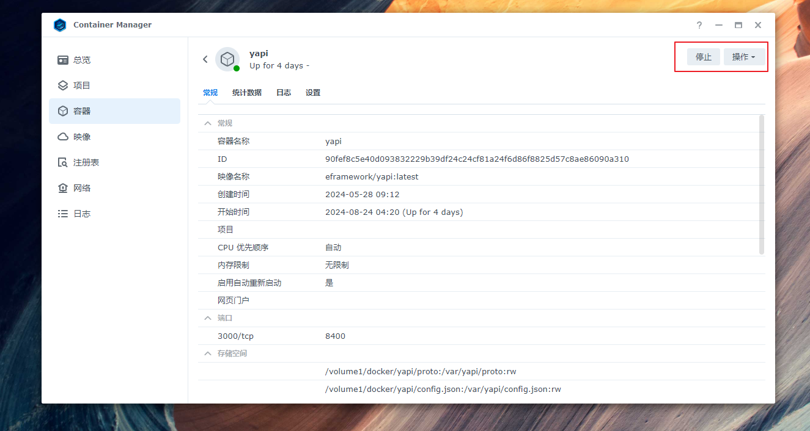

# nas

### 数据nas
- 172.16.167.220 
- 浏览器登录：**https://thxr-data.quickconnect.cn**
  - **https://172-16-167-220.thxr-data.direct.quickconnect.cn:5001/#/signin**
- 共享文件中心
    

### 项管平台nas
- 192.168.1.88/172.16.167.221
- 浏览器登录：**https://172-16-167-221.thxr-devops.direct.quickconnect.cn:5001/**
- 部署项管平台，日常运维需检测container是否正常运行
    
    
    

### 项管平台nas定期备份至数据nas
- 使用计划任务脚本定期备份平台数据，每周五晚上11点半进行备份
- 脚本内容如下
    ```shell
    /bin/bash /volume1/docker/work/backup.sh > /volume1/docker/work/log/$(date +%Y%m%d%H%M%S).log 2>&1
    ```
    
    
- 使用Hyper Backup套件同步数据到数据nas
    


