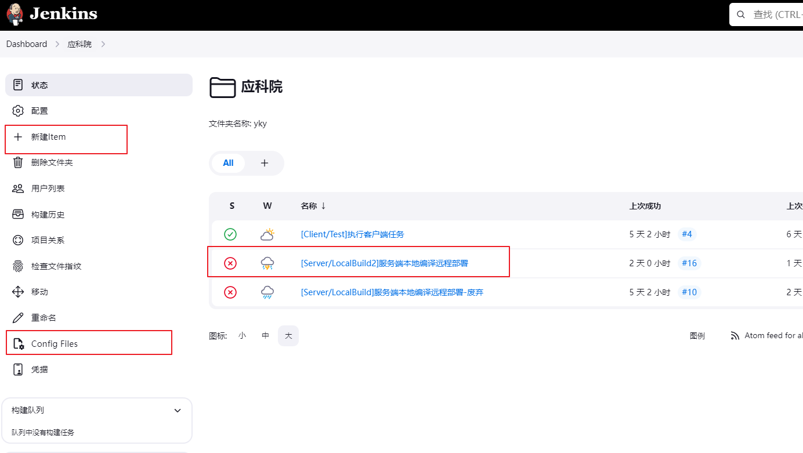

# 项管平台

## 平台说明
- 项管平台：[pm.tellhowxr.com](http://pm.tellhowxr.com "pm.tellhowxr.com")  8080（openproject）
- 持续构建：[cd.tellhowxr.com](http://cd.tellhowxr.com "cd.tellhowxr.com")   8800（jenkins）
- 协议联调：[yapi.tellhowxr.com](http://yapi.tellhowxr.com "yapi.tellhowxr.com")  3000（yapi）
- 代码托管：git.tellhowxr.com:8443:443/8880:80/8822:22（gitea）
- 弃用-tapd：[https://www.tapd.cn/](https://www.tapd.cn/ "https://www.tapd.cn/")

## jenkins服务器构建
- 最新本地打包远程部署模板可以参照yky01项目进行配置
- 具体配置步骤
  - 拷贝文件夹进行配置
  - 拷贝Item进行配置
    
  - 如果是远程部署需在打包机上配置ssh远程连接
    - 打包机是在thinkserver内网服务器上
  - 确保服务端项目中放入部署脚本
    - build.sh：编译脚本
    - config.sh：配置替换脚本
    - deploy.sh：部署脚本
    - start.sh：启动脚本
    - stop.sh：停止脚本
  - 配置文件替换模板，如test.config.yml
      ```纯文本
      env=test
      csl|ns=yky.test
      csl|addr=127.0.0.1:8500
      mysql|DB_Main|db=yky.test.main
      mysql|DB_Main|addr=127.0.0.1:3306
      mysql|DB_Main|pwd=123456
      cgi@client|addr=:10510
      conn@client|addr=:10506
      ```

## 内网访问域名配置
- 修改hosts文件
  ```纯文本
  172.16.167.221 git.tellhowxr.com
  172.16.167.221 pm.tellhowxr.com
  172.16.167.221 cd.tellhowxr.com
  172.16.167.221 yapi.tellhowxr.com
  ```

